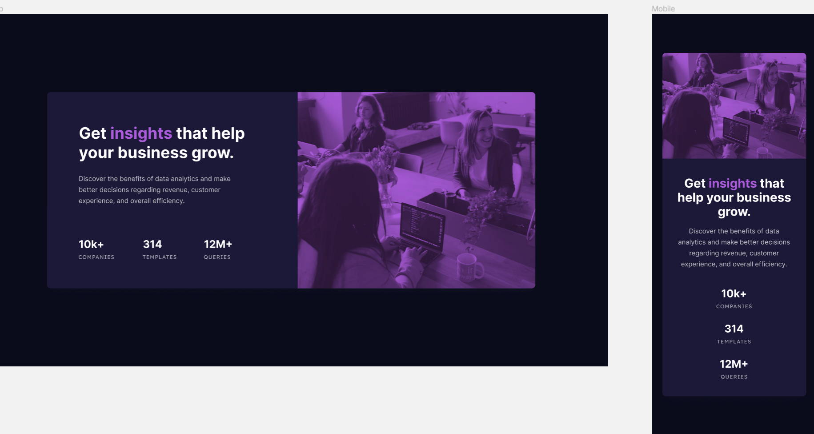
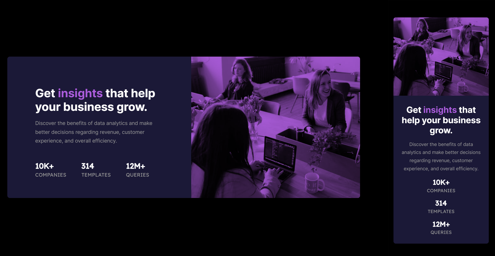

# Frontend Mentor - Stats preview card component solution

Hello, 你好, 안녕하세요, Hola, Hallo, Bonjour!

This is my solution to the [Stats preview card component challenge on Frontend Mentor](https://www.frontendmentor.io/challenges/stats-preview-card-component-8JqbgoU62). Frontend Mentor challenges help you improve your coding skills by building realistic projects. 

## Table of contents 🧵

- [Overview 🔎](https://github.com/JoleneKearse/fem-huddle-landing-page#overview-)
  - [The Challenge 🏁](https://github.com/JoleneKearse/fem-huddle-landing-page#the-challenge-)
  - [Screenshot 📸](https://github.com/JoleneKearse/fem-huddle-landing-page#screenshot-)
  - [Links 🔗](https://github.com/JoleneKearse/fem-huddle-landing-page#links-)

- [My Process 🤔](https://github.com/JoleneKearse/fem-huddle-landing-page#my-process-)
  - [Built with 🛠](https://github.com/JoleneKearse/fem-huddle-landing-page#built-with-)
  - [Useful resources 📚](https://github.com/JoleneKearse/fem-huddle-landing-page#useful-resources-)
- [Author 🤪](https://github.com/JoleneKearse/fem-huddle-landing-page#author-)
 - [My journey 📆](https://github.com/JoleneKearse/fem-huddle-landing-page#my-journey-)
 - [Let's connect 🗯](https://github.com/JoleneKearse/fem-huddle-landing-page#lets-connect-)

## Overview 🔎

### The Challenge 🏁

Users should be able to:
- [x] View the optimal layout for the page depending on their device's screen size

### Screenshot 📸

Here's the provided design files:

And, tada 🪄, my solution - also in desktop and mobile views:

### Links 🔗

- [Github](https://github.com/JoleneKearse/fem-stats-preview-card-component) - I certainly hope you're checking out this awesome-sauce README that I spent a fun evening composing!
- [Live link](https://frontend-mentor-tester.vercel.app/) - And also hope you, spectacular 🌟 you, have the time to impart your so-appreciated code reviews to me.  

## My Process 🤔

### Built with 🛠
- Semantic HTML5 markup
- CSS custom properties
- Mobile-first workflow
- `position: absolute`
- Flexbox

### Useful resources 📚

- [Font-size Clamp Generator](https://clamp.font-size.app/) - This tool allows you to set the smallest and largest font size, then it will scale automatically.

- [Viewport Resizer Chrome Extension](https://chrome.google.com/webstore/detail/viewport-resizer-%E2%80%93-respon/kapnjjcfcncngkadhpmijlkblpibdcgm/related?hl=en) - This makes it so much faster to check out different screen sizes.

- [mix-blend-mode](https://developer.mozilla.org/en-US/docs/Web/CSS/mix-blend-mode) - This was the color mode property I was searching for!

## Author 🤪

Hiya! 👋 My name is **Jolene Kearse**.  

I was an **English as a Foreign Language Teacher** ️🌏🧑‍🏫 for over 15 years - so, yeah, _for a little bit_ 🤌...  I lived all over the world, including China, England & South Korea.

But that was then! 

...

Now I'm an awesome **Software Engineer**! :dancer:  I'm a **proud, self-taught individual**. 

### My journey 📆

I'm also proud of how far I came in 2022.  I finally learned **JavaScript**! 🍻 _I had struggled for about a year before I finally could add that to my skillset.  If you're interested in an awesome 🔥 course check out **[Class Central's Bootcamp YouTube Playlist going through freeCodeCamp's Algorithms and Data Structures Certification](https://www.youtube.com/playlist?list=PLU3RKvMpgrSEoqVIV14K_zuinrIBcnCgT).**

Then I met an awesome group of fellow-learning devs, **The Explorers**.  This exposed me to the myriad and oft-confusing ways of using **Git** in a team - loving it now!  But also projects using so many kinds of tech that would've just blown my mind a year before 🤯 including:
- React
- TypeScript
- Tailwind

I even participated in **[#Hacktoberfest](https://hacktoberfest.com/)** and earned the coveted T-shirt! 🎉👕

But who cares about 2022? This is 2023!

...

I've been boning up on **React**, and just taking so many courses to learn **Backend Development** and **navigate the process of earning my first tech job**!

One of those courses has seen me going back to **Python** - which I had treated as my _crutch language_ to understand JavaScript.  🤣  But I've been loving navigating in multiple languages.

Another challenge I am undertaking this year is [Exercism's](https://exercism.org/) **#12in23**.  This is a cool 😎 opportunity to _try out_ 12 different languages this year.  Each month has a theme, like **Functional February** and **Mechanical March** to encourage you to check out different language paradims.  I'm loving this chance to dip my toe in other types of programming.  I find I'm gaining the ability to evaluate various languages' strengths and project needs.

### Let's connect 🗯

I'd love ❤️ to connect with y'all (_sorry, I love using that ironicallly and do so with great frequency_ 😜):
- [LinkedIn](https://www.linkedin.com/in/jolene-kearse-2562ba218/)
- [Github](https://github.com/JoleneKearse)
- [Twitter](https://twitter.com/FromJolene)
